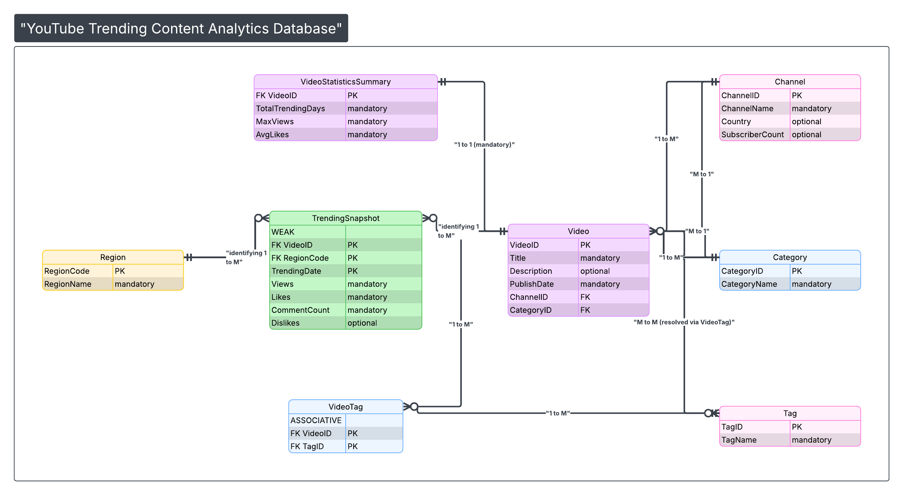

# Entity Relationship Diagram

This ER diagram represents the YouTube Trending Content Analytics Database. 
It models video metadata, daily trending metrics, and analytical relationships 
between videos, tags, regions, and channels.

## User Groups

- Data Analysts – analyze trending performance and engagement growth.
- Researchers/Students – study content popularity patterns.
- Content Creators – evaluate trending behavior across regions.

## ER Diagram

Link for Diagram ^

## Final Normalized Relational Schema (BCNF)

The following relational schema was derived from the ER diagram and verified to be in Boyce-Codd Normal Form (BCNF).

Channel(ChannelID PK, ChannelName, Country, SubscriberCount)

Category(CategoryID PK, CategoryName)

Video(VideoID PK, Title, Description, PublishDate, ChannelID FK, CategoryID FK)

Region(RegionCode PK, RegionName)

Tag(TagID PK, TagName)

VideoTag(VideoID PK FK, TagID PK FK)

TrendingSnapshot(VideoID PK FK, RegionCode PK FK, TrendingDate PK, Views, Likes, CommentCount, Dislikes)

VideoStatisticsSummary(VideoID PK FK, TotalTrendingDays, MaxViews, AvgLikes)

All relations were analyzed using functional dependencies and confirmed to satisfy BCNF. No decomposition was required.
